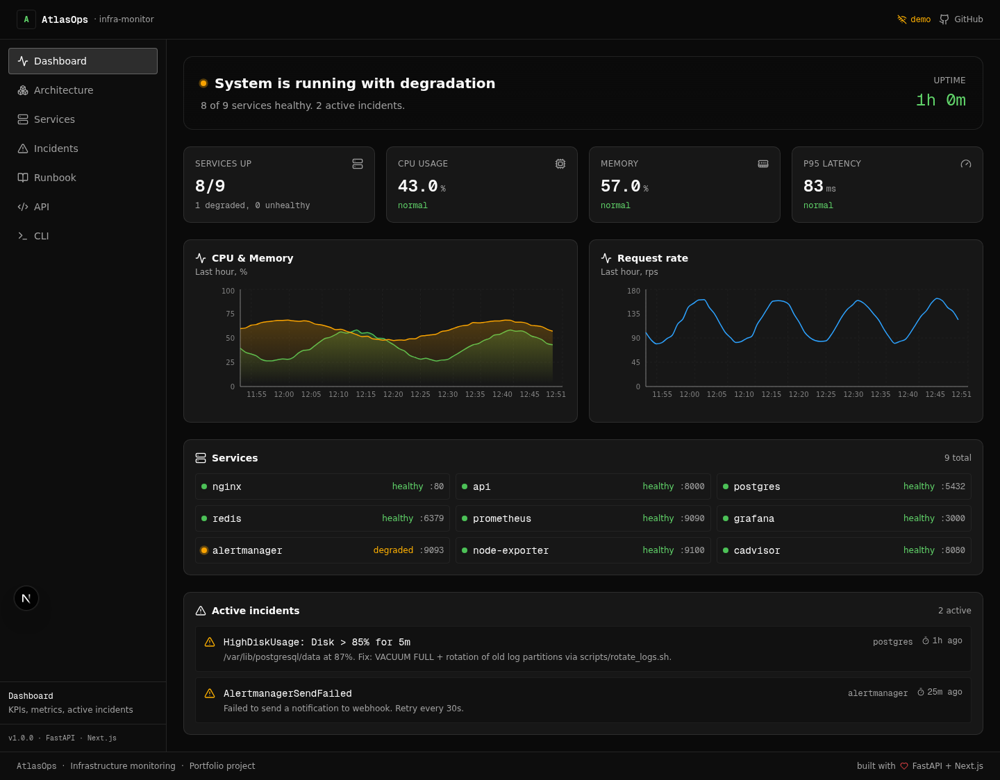
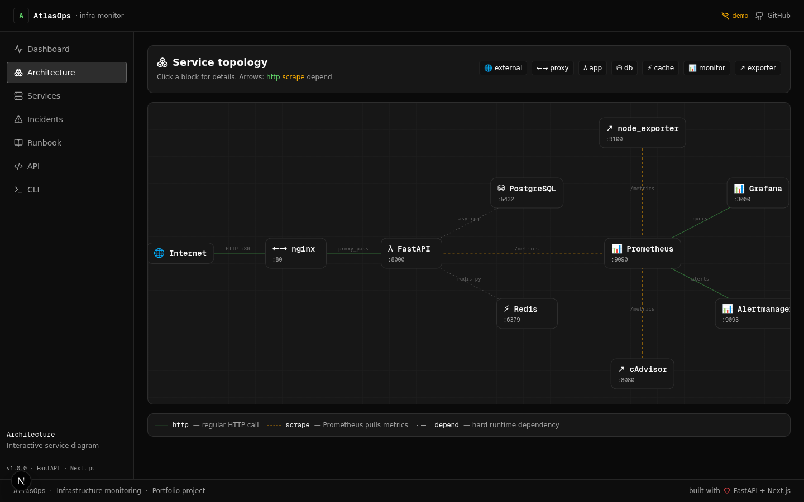
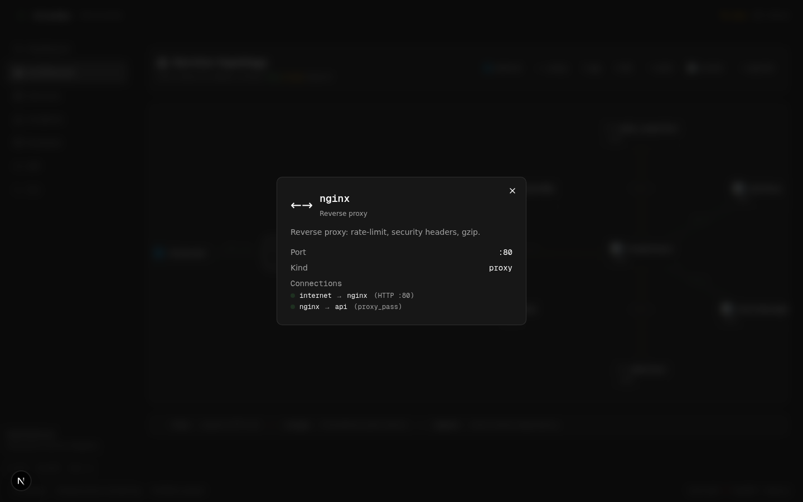
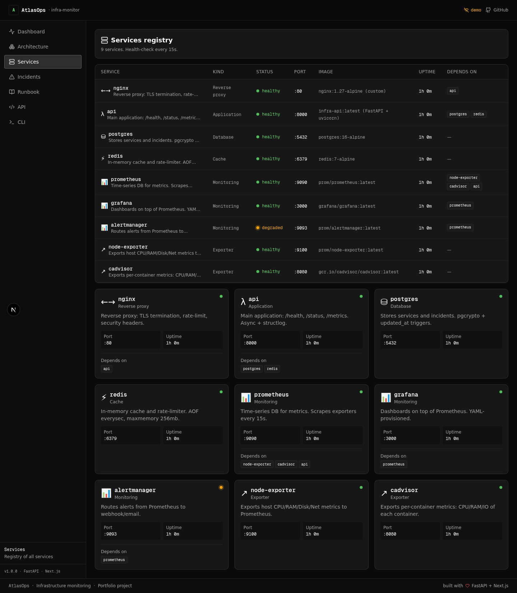
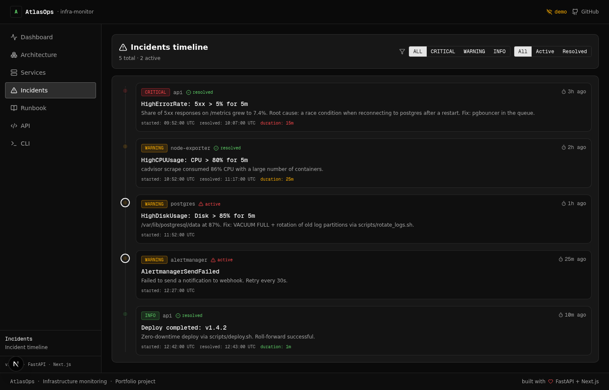
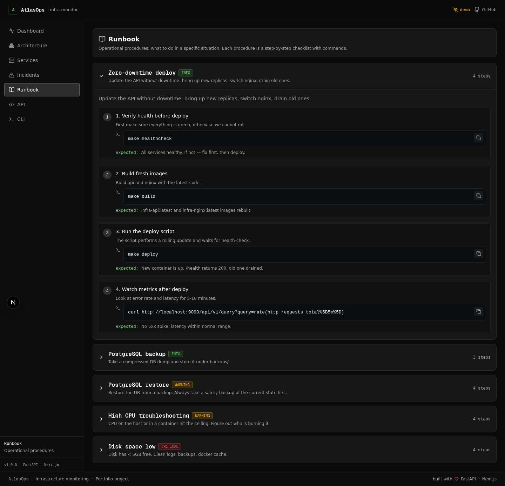
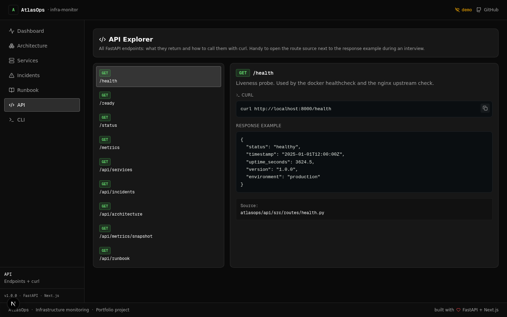
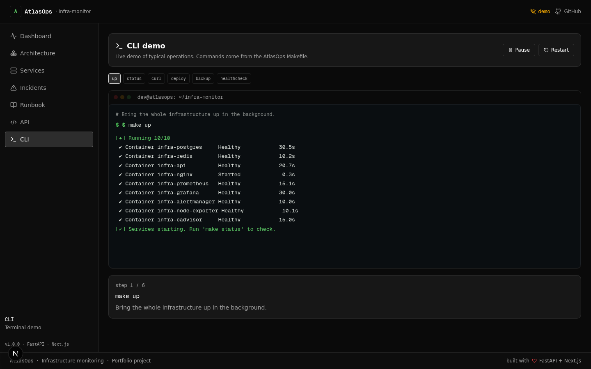

# AtlasOps — Платформа мониторинга инфраструктуры

> Production-grade DevOps-стек мониторинга: FastAPI + PostgreSQL + Redis + Nginx + Prometheus + Grafana + Alertmanager — с интерактивным Next.js-дашбордом сверху. Сделано как портфолио-проект уровня junior DevOps.


---

## Содержание

- [Обзор](#обзор)
- [Скриншоты](#скриншоты)
- [Архитектура](#архитектура)
- [Стек](#стек)
- [Структура репозитория](#структура-репозитория)
- [Быстрый старт](#быстрый-старт)
- [Фронтенд-дашборд](#фронтенд-дашборд)
- [Бэкенд API](#бэкенд-api)
- [Мониторинг](#мониторинг)
- [Скрипты](#скрипты)
- [CI/CD](#cicd)
- [Roadmap](#roadmap)
- [Лицензия](#лицензия)

---

## Обзор

**AtlasOps** — self-hosted платформа мониторинга инфраструктуры, которая собирает в одном месте всё, что нужно junior DevOps-инженеру для демонстрации end-to-end навыков:

- **FastAPI**-сервис с эндпоинтами `/health`, `/status`, `/metrics` и набором JSON-эндпоинтов для дашборда.
- **Docker Compose**-стек с PostgreSQL, Redis, Nginx, Prometheus, Grafana, Alertmanager, node_exporter и cAdvisor — у каждого сервиса есть healthcheck.
- **Next.js 16 дашборд** с семью интерактивными секциями (живые KPI, диаграмма архитектуры, таблица сервисов, таймлайн инцидентов, runbook, API-проводник, анимированное CLI-демо).
- **CI-пайплайн**, который линтит Python, TypeScript, YAML, shell и Markdown на каждом пуше.

Дашборд работает в двух режимах:
- **`live`** — когда FastAPI-бэкенд доступен, UI берёт реальные данные.
- **`demo`** — когда бэкенд недоступен, UI прозрачно падает на мок-данные, так что проект можно показать где угодно без поднятия Docker.

---

## Скриншоты

> Все скриншоты лежат в [`docs/screenshots/`](./docs/screenshots). Ниже они подключены относительными путями, поэтому напрямую рендерятся на GitHub.

### 1. Dashboard

KPI-карточки, живые графики CPU/Memory/Request-rate (Recharts), компактный список сервисов и активные инциденты. Автообновление каждые 30 секунд.



### 2. Architecture

Интерактивная топология сервисов. Клик по любому блоку открывает его детали и связи. Три типа стрелок: `http` (зелёная сплошная), `scrape` (жёлтая пунктирная), `depend` (серая точечная).



Клик по ноде открывает модалку с портом, типом и списком связей:



### 3. Services

Полный реестр: табличный вид сверху, детальные карточки снизу. Каждая карточка показывает порт, аптайм, зависимости и живой статус health-check.



### 4. Incidents

Таймлайн с фильтрами по severity (`critical` / `warning` / `info`) и по состоянию (`all` / `active` / `resolved`). У каждого инцидента — время старта, резолва и длительность.



### 5. Runbook

Операционные процедуры в виде раскрывающихся карточек: деплой, бэкап, восстановление, траблшутинг высокого CPU, восстановление при переполнении диска. У каждого шага есть описание, команда (с кнопкой копирования) и ожидаемый результат.



### 6. API Explorer

Интерактивная документация по каждому эндпоинту FastAPI: метод, путь, описание, пример `curl` и пример JSON-ответа. Кликаешь эндпоинт слева — видишь его детали справа.



### 7. CLI demo

Анимированный терминал, который «печатает» типичные `make`-команды (`make up`, `make deploy`, `make backup`, `make healthcheck`) и построчно показывает вывод. Управление: Play / Pause / Restart.



---

## Архитектура

```
┌─────────────────────────────────────────────────────────────────┐
│                        Load Balancer                            │
│                           (nginx)                               │
│                            :80                                   │
└──────────────────────────┬──────────────────────────────────────┘
                           │
              ┌────────────┼────────────┐
              │            │            │
              ▼            ▼            ▼
         ┌─────────┐ ┌─────────┐ ┌─────────┐
         │ /health │ │ /status │ │ /metrics│
         └────┬────┘ └────┬────┘ └────┬────┘
              │            │            │
              └────────────┼────────────┘
                           │
                      ┌────┴────┐
                      │   API   │
                      │(FastAPI)│
                      │  :8000  │
                      └────┬────┘
                           │
              ┌────────────┼────────────┐
              │            │            │
              ▼            ▼            ▼
         ┌─────────┐ ┌─────────┐ ┌─────────┐
         │PostgreSQL│ │  Redis  │ │Prometheus│
         │  :5432   │ │  :6379  │ │  :9090   │
         └─────────┘ └─────────┘ └─────┬────┘
                                       │
                              ┌────────┼────────┐
                              │        │        │
                              ▼        ▼        ▼
                        ┌─────────┐ ┌───────┐ ┌──────────┐
                        │ Grafana │ │Alert  │ │Node      │
                        │  :3000  │ │Manager│ │Exporter  │
                        └─────────┘ │ :9093 │ │  :9100   │
                                    └───────┘ └──────────┘
```

Дашборд (Next.js, порт 3000) стоит рядом со стеком и ходит в FastAPI-эндпоинты `/api/*`.

---

## Стек

| Слой | Технология | Назначение |
|------|-----------|------------|
| Reverse proxy | Nginx 1.27 | Балансировка, security-заголовки, rate limiting |
| API-сервис | Python 3.12 + FastAPI | Health, status, metrics + JSON-эндпоинты для дашборда |
| База данных | PostgreSQL 16 | Постоянное хранилище |
| Кэш | Redis 7 | Сессионный кэш, rate limiting |
| Метрики | Prometheus | Time-series хранилище метрик |
| Дашборды | Grafana | Визуализация и алертинг |
| Алертинг | Alertmanager | Роутинг и нотификации |
| Системные метрики | node_exporter | Метрики хоста |
| Контейнерные метрики | cAdvisor | Per-container мониторинг ресурсов |
| Фронтенд | Next.js 16 + TypeScript + Tailwind + shadcn/ui | Интерактивный дашборд |

---

## Структура репозитория

```
atlasops/
├── .github/
│   └── workflows/
│       └── ci.yml                   # CI: lint Python, TS, YAML, shell, Markdown
├── .gitignore
├── .env.example                     # скопировать в .env и подправить
├── docker-compose.yml               # весь стек в одном файле
├── Makefile                         # make up / down / build / backup / deploy / ...
├── README.md                        # этот файл
│
├── api/                             # FastAPI-бэкенд
│   ├── Dockerfile
│   ├── requirements.txt
│   ├── ruff.toml                    # настройки линтера ruff
│   ├── src/
│   │   ├── main.py                  # точка входа, middleware, регистрация роутов
│   │   ├── config.py                # pydantic-settings
│   │   ├── metrics.py               # Prometheus-счётчики / гистограммы
│   │   └── routes/
│   │       ├── health.py            # /health, /ready
│   │       ├── status.py            # /status
│   │       ├── services.py          # /api/services
│   │       ├── incidents.py         # /api/incidents
│   │       ├── architecture.py      # /api/architecture
│   │       ├── metrics_snapshot.py  # /api/metrics/snapshot
│   │       └── runbook.py           # /api/runbook
│   └── tests/
│       ├── test_health.py
│       ├── test_dashboard_api.py
│       └── conftest.py
│
├── web/                             # Next.js-дашборд
│   ├── package.json
│   ├── next.config.ts
│   ├── tsconfig.json
│   ├── tailwind.config.ts
│   ├── eslint.config.mjs
│   ├── postcss.config.mjs
│   ├── components.json              # shadcn/ui конфиг
│   ├── public/
│   ├── README.md                    # документация фронтенда
│   └── src/
│       ├── app/
│       │   ├── layout.tsx           # корневой layout, тёмная тема, шрифты
│       │   ├── page.tsx             # главная страница: sidebar + роутер секций
│       │   └── globals.css          # Tailwind + кастомные стили
│       ├── components/
│       │   ├── atlas/               # переиспользуемые атомы
│       │   │   ├── status-dot.tsx
│       │   │   ├── status-badge.tsx
│       │   │   ├── code-block.tsx
│       │   │   └── kpi-card.tsx
│       │   └── sections/            # семь секций UI
│       │       ├── dashboard-section.tsx
│       │       ├── architecture-section.tsx
│       │       ├── services-section.tsx
│       │       ├── incidents-section.tsx
│       │       ├── runbook-section.tsx
│       │       ├── api-section.tsx
│       │       └── cli-section.tsx
│       └── lib/
│           ├── types.ts             # общий контракт с бэкендом
│           ├── api.ts               # fetcher с fallback на моки
│           ├── mock-data.ts         # данные для demo-режима
│           └── format.ts            # форматтеры (uptime, relative time, ...)
│
├── nginx/
│   ├── Dockerfile
│   └── nginx.conf                   # rate-limit, security headers, JSON-логи
│
├── postgres/
│   └── init.sql                     # схема: services, incidents + триггеры
│
├── redis/
│   └── redis.conf                   # AOF, maxmemory 256mb, LRU
│
├── monitoring/
│   ├── prometheus/
│   │   ├── prometheus.yml
│   │   └── alert.rules.yml
│   ├── alertmanager/
│   │   └── config.yml
│   └── grafana/
│       ├── dashboards/
│       │   └── infrastructure.json
│       └── provisioning/
│           ├── dashboards/provider.yml
│           └── datasources/datasource.yml
│
├── scripts/
│   ├── deploy.sh                    # zero-downtime деплой
│   ├── backup.sh                    # pg_dump + gzip
│   ├── restore.sh                   # восстановление с safety-бэкапом
│   ├── healthcheck.sh               # полная проверка здоровья
│   ├── rotate_logs.sh               # ротация логов
│   └── cleanup.sh                   # docker prune
│
├── systemd/
│   └── infra-monitor.service        # опциональный systemd-unit
│
└── docs/
    ├── architecture.md
    ├── deployment.md
    ├── monitoring.md
    └── screenshots/                 # скриншоты дашборда для README
        ├── 01-dashboard.png
        ├── 02-architecture.png
        ├── 02b-architecture-modal.png
        ├── 03-services.png
        ├── 04-incidents.png
        ├── 05-runbook.png
        ├── 06-api.png
        └── 07-cli.png
```

---

## Быстрый старт

### 1. Клонирование

```bash
git clone https://github.com/Imronaxl/AtlasOps.git
cd AtlasOps
```

### 2. Настройка окружения

```bash
cp .env.example .env
# отредактировать .env — заменить все "change_me_*" заглушки
```

### 3. Поднятие стека

```bash
make up
make status
```

Должно быть 9 healthy-контейнеров: `nginx`, `api`, `postgres`, `redis`, `prometheus`, `grafana`, `alertmanager`, `node-exporter`, `cadvisor`.

### 4. Запуск дашборда

```bash
cd web
npm install
npm run dev
```

Открыть <http://localhost:3000> — индикатор в шапке должен переключиться с `demo` на `live`.

### 5. Доступ к отдельным сервисам

| Сервис | URL | Учётные данные |
|--------|-----|----------------|
| Дашборд | http://localhost:3000 | — |
| API (FastAPI) | http://localhost:8000 | — |
| Grafana | http://localhost:3000 | admin / (из .env) |
| Prometheus | http://localhost:9090 | — |
| Alertmanager | http://localhost:9093 | — |

> Дашборд работает на порту 3000 — это совпадает с портом Grafana по умолчанию. Чтобы избежать конфликта, либо остановите Grafana (`docker compose stop grafana`), либо запустите дашборд на другом порту: `npm run dev -- -p 3001`.

---

## Фронтенд-дашборд

Дашборд — это Next.js 16 приложение в директории [`web/`](./web). Состоит из семи секций, доступных из сайдбара:

| Секция | Что показывает |
|--------|----------------|
| **Dashboard** | KPI (services up, CPU, memory, P95 latency), живые Recharts-графики, активные инциденты |
| **Architecture** | Интерактивная топология сервисов с кликабельными деталями |
| **Services** | Таблица реестра + детальные карточки: статус, порт, образ, аптайм, зависимости |
| **Incidents** | Таймлайн с фильтрами по severity и active/resolved |
| **Runbook** | Пошаговые операционные процедуры с командами и ожидаемым результатом |
| **API** | Интерактивный проводник: метод, путь, curl, пример JSON-ответа |
| **CLI** | Анимированное демо терминала с `make up`, `make deploy`, `make backup`, ... |

### Ключевые фичи

- **Live / demo режим**: API-клиент имеет таймаут 2.5s и падает на мок-данные. В шапке видно `live` или `demo`, перепроверка каждые 30 секунд.
- **Тёмная тема** по умолчанию — привычная для DevOps-инструментов (Grafana, Datadog, ...).
- **framer-motion** — плавные переходы между секциями, пульсирующие status-точки, эффект печати в терминале.
- **Адаптивность**: сайдбар на десктопе, горизонтальное скролл-меню на мобиле.
- **Не нужны внешние данные**: мок-слой зеркалит бэкенд, поэтому UI полностью функционален самостоятельно.

Подробнее — в [`web/README.md`](./web/README.md).

---

## Бэкенд API

FastAPI-приложение в [`api/`](./api). Эндпоинты:

| Метод | Путь | Описание |
|-------|------|----------|
| GET | `/health` | Liveness-проба — используется docker healthcheck |
| GET | `/ready` | Readiness-проба (проверяет зависимости) |
| GET | `/status` | Сводка по приложению: версия, окружение, аптайм |
| GET | `/metrics` | Метрики в Prometheus text format |
| GET | `/api/services` | Список всех отслеживаемых сервисов |
| GET | `/api/services/{name}` | Один сервис по имени |
| GET | `/api/services/{name}/health` | Упрощённый health для одного сервиса |
| GET | `/api/incidents` | Журнал инцидентов (фильтры `?severity=`, `?resolved=`) |
| GET | `/api/incidents/active` | Только активные (неразрешённые) инциденты |
| GET | `/api/architecture` | Граф сервисов (nodes + edges + legend) |
| GET | `/api/metrics/snapshot` | Снимок метрик за час, готовый для Recharts |
| GET | `/api/runbook` | Все операционные процедуры |
| GET | `/api/runbook/{id}` | Одна процедура по id |

CORS открыт для разработки. В проде сузить `allow_origins` в `api/src/main.py` до реального домена.

---

## Мониторинг

### Точки доступа

| Сервис | URL |
|--------|-----|
| Grafana | http://localhost:3000 |
| Prometheus | http://localhost:9090 |
| Alertmanager | http://localhost:9093 |

### Дашборды

- **Infrastructure Monitoring** — CPU, Memory, Disk, Network, Containers, метрики API

### Правила алертов

| Алерт | Условие | Severity |
|-------|---------|----------|
| HighCPUUsage | CPU > 80% в течение 5m | Warning |
| HighMemoryUsage | Memory > 90% в течение 5m | Warning |
| HighDiskUsage | Disk > 85% в течение 5m | Warning |
| ContainerDown | Контейнер упал на 1m | Critical |
| ContainerHighCPU | CPU контейнера > 80% в течение 5m | Warning |
| APILatencyHigh | p95 > 1s в течение 5m | Warning |
| HighErrorRate | 5xx > 5% в течение 5m | Critical |
| DiskSpaceLow | < 5GB свободного места в течение 5m | Critical |

---

## Скрипты

| Скрипт | Описание |
|--------|----------|
| `scripts/deploy.sh` | Zero-downtime деплой |
| `scripts/backup.sh` | Бэкап PostgreSQL со сжатием |
| `scripts/restore.sh` | Восстановление БД с safety-бэкапом |
| `scripts/healthcheck.sh` | Полная проверка здоровья |
| `scripts/rotate_logs.sh` | Ротация и очистка логов |
| `scripts/cleanup.sh` | Очистка Docker-ресурсов |

Удобные Make-таргеты оборачивают все скрипты: `make deploy`, `make backup`, `make restore`, `make healthcheck`, `make rotate-logs`, `make cleanup`.

---

## CI/CD

Пайплайн живёт в [`.github/workflows/ci.yml`](./.github/workflows/ci.yml). На каждый пуш / PR в `main`:

```
┌─────────────┬─────────────┬─────────────┬─────────────┐
│  backend    │  frontend   │   docker    │    misc     │
│ (FastAPI)   │ (Next.js)   │ (compose)   │ (yaml/sh/md)│
├─────────────┼─────────────┼─────────────┼─────────────┤
│ ruff lint   │ npm install │ compose     │ yamllint    │
│ ruff format │ eslint      │  config     │ shellcheck  │
│ pytest      │ tsc --noEmit│ hadolint x2 │ markdownlint│
└─────────────┴─────────────┴─────────────┴─────────────┘
```

Все четыре джобы идут параллельно. Пайплайн должен быть зелёным перед мержем.

---

## Roadmap

- [ ] WebSocket push для live-метрик (вместо поллинга каждые 30s)
- [ ] NextAuth.js-аутентификация для дашборда
- [ ] Страницы детализации по каждому сервису с историческими графиками
- [ ] PDF-экспорт процедур runbook
- [ ] Terraform / Ansible provisioning для облачного деплоя
- [ ] Multi-node Prometheus federation через Thanos

---

## Лицензия

MIT — см. [LICENSE](./LICENSE).
